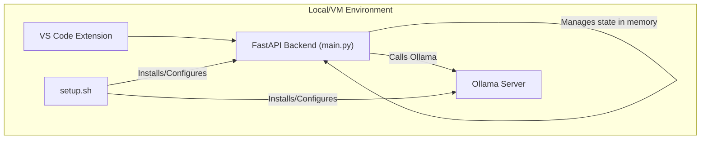
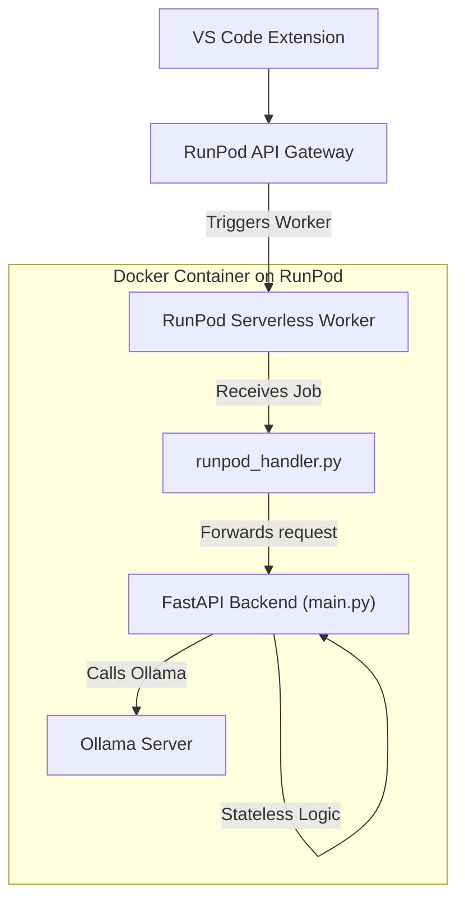

# 🚀 LabNote AI 백엔드 서버리스 전환 가이드 (RunPod)

이 문서는 기존의 `labnote-ai-backend`와 `labnote-llm-server`를 통합하여, RunPod을 활용한 서버리스(Serverless) 아키텍처로 전환하는 과정과 그에 따른 코드 변경 사항을 상세히 기술합니다.

## 1. 목표

- **아키텍처 현대화**: 단일 서버에서 실행되던 백엔드와 LLM 서버를 분리하고, 요청에 따라 동적으로 확장/축소되는 서버리스 워커(Worker) 구조로 전환합니다.
- **운영 효율성 증대**: `setup.sh`와 같은 복잡한 초기 설정 과정을 Docker 이미지 빌드 과정에 통합하여 배포를 자동화하고, GPU 자원을 효율적으로 사용합니다.
- **상태 비저장(Stateless) 설계**: 서버리스 환경의 핵심 원칙인 상태 비저장(Stateless)을 적용하여 각 API 요청이 독립적으로 처리되도록 백엔드 로직을 수정합니다. 이를 통해 확장성을 극대화합니다.

---

## 2. 아키텍처 변경: Current vs. Target

### 현재 아키텍처

현재 시스템은 VS Code 확장 프로그램, 단일 FastAPI 백엔드, 그리고 로컬 Ollama 서버가 하나의 환경에 공존하는 구조입니다.

### 목표 아키텍처 (서버리스)

새로운 구조에서는 VS Code 확장 프로그램이 RunPod API 게이트웨이를 통해 요청을 보내면, RunPod이 필요에 따라 서버리스 워커를 실행하여 요청을 처리합니다. 모든 의존성은 Docker 이미지에 패키징됩니다.

---

## 3. 핵심 변경 사항

### A. 컨테이너화 (Containerization)

`labnote-llm-server/setup.sh`의 모든 설정 과정과 `labnote-ai-backend`의 실행 환경을 하나의 `Dockerfile`로 통합합니다.

- **베이스 이미지**: RunPod이 제공하는 PyTorch 및 CUDA 지원 Docker 이미지를 사용합니다. (예: `runpod/pytorch:2.1.0-cuda12.1.1-devel-ubuntu22.04`)
- **의존성 설치**: `apt-get`으로 `redis-stack-server`를, `curl`로 `ollama`를 설치합니다. `requirements.txt`의 Python 패키지도 설치합니다.
- **모델 다운로드**: `ollama pull` 명령을 Dockerfile에 포함시켜 이미지 빌드 시점에 모든 LLM 모델(llama3.1, mixtral, nomic-embed-text 등)을 다운로드합니다. 모델은 RunPod의 네트워크 볼륨에 저장하여 워커 재시작 시에도 유지되도록 설정합니다.
- **엔트리포인트**: 컨테이너 시작 시 Redis, Ollama, FastAPI 서버를 순차적으로 실행하는 스크립트를 실행합니다.

### B. 상태 비저장(Stateless)으로의 전환

서버리스 환경에서는 각 요청이 다른 워커에서 처리될 수 있으므로, 서버 메모리에 대화 상태를 저장할 수 없습니다.

- **`main.py` 수정**:
    - **`conversation_histories` 제거**: 서버 메모리에 대화 내용을 저장하던 전역 변수 `conversation_histories`를 완전히 제거합니다.
    - **`lifespan` 및 `keep_gpu_warm` 제거**: 단일 서버 유지를 위한 `lifespan` 컨텍스트 매니저와 GPU 활성화 태스크 `keep_gpu_warm`을 제거합니다. 모델 로딩 및 워커 활성화는 RunPod 플랫폼이 담당합니다.
    - **`/clear_history` 엔드포인트 제거**: 더 이상 서버에 저장되는 기록이 없으므로 해당 엔드포인트를 삭제합니다.

- **상태 관리 책임 이전**:
    - **새로운 요청/응답 구조**: 이제 클라이언트(VS Code 확장)가 전체 대화 상태(`context`)를 관리합니다.
        1. 클라이언트가 요청 시 현재까지의 `messages`와 `context` 객체를 함께 보냅니다.
        2. 서버는 요청을 처리한 후, 변경된 `context`를 포함하여 응답합니다.
        3. 클라이언트는 응답받은 `context`를 저장했다가 다음 요청에 다시 사용합니다.
    - **`ChatRequest`, `ChatResponse` 모델 변경**: Pydantic 모델에 `context` 필드를 추가하여 상태를 주고받습니다.

### C. RunPod 핸들러 구현

RunPod 서버리스 워커의 진입점 역할을 하는 `runpod_handler.py` 파일을 생성합니다.

- **역할**: RunPod 플랫폼으로부터 작업(`job`)을 받아, 내장된 FastAPI 애플리케이션으로 요청을 전달하는 역할을 합니다.
- **구현 패턴**: `uvicorn` 서버를 프로세스로 실행하고, 받은 요청을 `httpx`와 같은 클라이언트를 사용하여 FastAPI의 해당 엔드포인트로 전달합니다. 이 방식은 기존 FastAPI 코드를 거의 수정하지 않고 서버리스 환경에 통합할 수 있게 해줍니다.

### D. VS Code 확장 프로그램 수정 (`extension.ts`)

백엔드가 상태 비저장으로 변경됨에 따라, 클라이언트인 VS Code 확장 프로그램도 이에 맞춰 수정해야 합니다.

- **`chatSessions` 활용**: 기존의 `chatSessions` Map을 활용하여 백엔드로부터 받은 `context` 객체를 저장합니다.
- **API 호출 로직 변경**: `fetch`를 사용하여 백엔드 API를 호출하는 모든 함수에서, 요청 본문에 현재 `context`를 포함하도록 수정합니다.
- **컨텍스트 업데이트**: API 응답으로 새로운 `context`를 받으면, 이를 `chatSessions`에 다시 저장하여 다음 요청에 대비합니다.

---

## 4. API 및 고급 기능 전략

- **`/v1/chat/completions` (Continue 통합)**: 이 엔드포인트는 Continue 확장과의 호환성을 위해 필수적입니다. `file_content`, `experiment_goal` 등 필요한 정보를 메시지 히스토리에서 추론하는 기존의 전처리 로직은 그대로 유지하며, 서버리스 함수 내에서 완벽하게 동작합니다.
- **에이전트 및 오케스트레이션**: 사용자가 언급한 'GPT-OSS/Llama3.1을 이용한 오케스트레이션'은 현재 `main.py`의 `chat` 함수가 `/populate`와 같은 명령어를 감지하여 에이전트 기반의 RAG 파이프라인으로 요청을 라우팅하는 방식으로 이미 단순하게 구현되어 있습니다. 이 로직은 상태 비저장 설계에 맞춰 그대로 유지 및 강화됩니다.

이러한 변경을 통해 LabNote AI는 더 안정적이고 확장 가능한 최신 아키텍처로 거듭날 것입니다.
