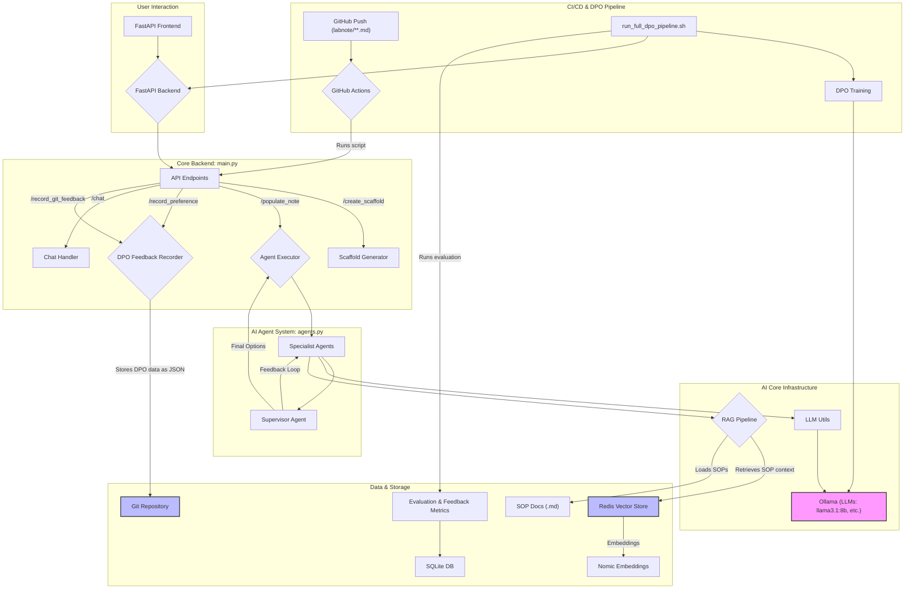
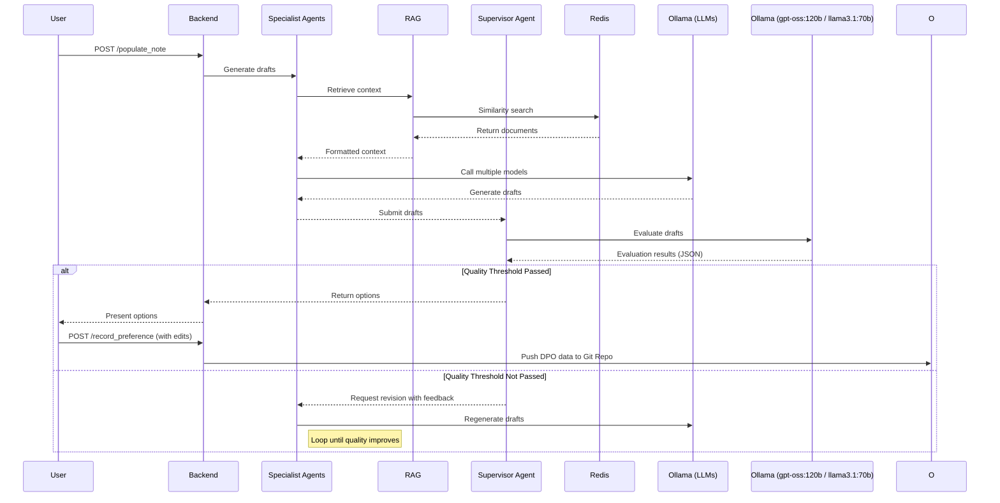

# LabNote AI Backend

`labnote-ai-backend`는 실험실 노트 작성을 자동화하고 가속화하기 위해 설계된 AI 기반 백엔드 시스템입니다. 이 시스템은 실험자가 실험 설계, 절차, 결과 기록 등의 과정을 보다 효율적으로 수행할 수 있도록 지원하며, 사용자의 피드백을 통해 지속적으로 학습하고 발전하는 DPO (Direct Preference Optimization) 파이프라인을 갖추고 있습니다.

## 목차

  - [0. RunPod Serverless 배포 빠른 시작]
  - [1. 시스템 아키텍처]
  - [2. 핵심 기능]
  - [3. 작동 방식 (데이터 흐름)]
  - [4. 프로젝트 구조]
  - [5. 로컬 개발 환경 (선택 사항)]
  - [6. 실행 방법]
  - [7. 주요 기술 스택]
  - [8. API 엔드포인트]
  - [9. VS Code Continue 연동 가이드 (RunPod Serverless)]
----- 

## 최근 업데이트 (2025-10-29)

- 새 엔드포인트 추가: `POST /record_chat_preference` — 채팅으로 생성된 텍스트를 바로 DPO Git 리포지토리에 저장합니다.
- UO 헤더 파싱 개선: 시각 편집기에서 생성되는 이스케이프된 괄호도 인식합니다. 예) `### \[USW080 Protein ...]` 와 `### [USW080] Protein ...` 모두 지원.
- VS Code 확장 출력 형식 변경: 유닛 오퍼레이션을 `### [USW080] Protein Structure Generation new` 형태로 생성합니다. (제목은 괄호 밖)
- 품질 임계값 하향: Supervisor 평가 통과 기준을 8.0 → 5.0으로 낮춰 초안 제안 속도를 개선했습니다.
- 성능/안정성 플래그 정리: 서버 시작 스크립트(`start.sh`)에 GPU 디버그 로그, 모델 캐시 경로, 선택적 GPU 셀프 테스트(ENV `ENABLE_GPU_SELFTEST=1`) 등을 추가했습니다.

## 최근 업데이트 (2025-10-13)

- **기본 모델 변경**: 백엔드의 기본 모델이 `kobiomed-llama`에서 메타의 `llama3.1:8b`로 전환되었습니다. 보다 안정적인 기본 문체와 명령 준수력을 확보하기 위함입니다.
- **환경 설정 업데이트**: `.env`의 `LLM_MODEL` 기본값과 에이전트 파이프라인 구성(예: `agents.py`)이 모두 `llama3.1:8b`를 기준으로 동기화되었습니다.
- **VS Code 연동 가이드 수정**: Continue 설정(`config.yaml`) 역시 최신 모델 이름으로 갱신되었습니다.

## 이전 업데이트 (2025-10-08)

- DPO 학습 파이프라인이 gradient checkpointing 환경에서 안전하게 동작하도록 `run_dpo_training.py`를 보강했습니다. (`model.config.use_cache=False`, `model.gradient_checkpointing_enable()` 적용)
- 기준 모델을 중복 로드하지 않도록 `precompute_ref_log_probs=True`를 사용하고, 기본 옵티마이저를 8bit AdamW(`paged_adamw_8bit`)로 전환해 A100 40GB에서도 학습이 OOM 없이 진행됩니다.
- `run_full_dpo_pipeline.sh` 실행 시 Step 2의 배포 스크립트가 llama.cpp 최신 구조(언더스코어 스크립트명, `llama-quantize` 바이너리)에 맞춰 동작하도록 조정했습니다. 자세한 내용은 `labnote-llm-server/README.md` 참고.

## 0. RunPod Serverless 배포 빠른 시작

1. **컨테이너 이미지 빌드 및 푸시**
   - `./build_and_push.sh <TAG>`를 실행하면 Step 1에서 베이스 이미지(`mimikyou0607/labnote-ai-base`)를, Step 2에서 최종 애플리케이션 이미지(`mimikyou0607/labnote-ai-app`)를 빌드하고 Docker Hub로 푸시합니다.
   - 베이스 이미지는 LLM/Redis/Ollama 같은 무거운 의존성을 포함하므로 자주 바뀌지 않습니다. 코드 변경만 있다면 Step 2만 다시 실행하면 됩니다.

2. **RunPod Serverless 엔드포인트 구성**
   - *Container Image*: `mimikyou0607/labnote-ai-app:<TAG>`
   - *Container Start Command*: 기본값(`./start.sh`)을 그대로 사용합니다. 이 스크립트가 Redis · Ollama · FastAPI 런타임을 모두 기동합니다.
   - *Volume Mount*: `/runpod-volume` (영속 모델 캐시 `ollama_models`가 저장됩니다.)
   - *Secrets*: GitHub 저장소를 클론하기 위한 토큰을 `github_token` 이름으로 등록하고, Serverless 옵션에서 `--secret id=github_token`과 동일한 이름을 사용합니다.

3. **런타임 환경 변수**
   - `LABNOTE_BACKEND_URL` (기본값 `http://127.0.0.1:8000`) : 컨테이너 내부 FastAPI URL입니다. 특별한 경우가 아니면 수정이 필요 없습니다.
   - `LABNOTE_RUNPOD_TIMEOUT` : RunPod 작업 실행 최대 대기 시간(초). 기본 600초이며, 긴 DPO 요청 시 필요에 따라 조정할 수 있습니다.
   - Redis/Ollama 설정은 `start.sh`가 자동으로 구성하므로 별도 환경 변수는 필요하지 않습니다.

4. **API 호출 패턴**
   - RunPod Serverless는 HTTP 포트를 직접 노출하지 않고, `https://api.runpod.ai/v2/<ENDPOINT_ID>/run`(비동기) 또는 `/runsync`(동기) 엔드포인트를 통해 요청을 트리거합니다.
  - 요청 본문은 백엔드 경로 정보를 포함하는 다음 형태를 따릅니다.

```bash
curl "https://api.runpod.ai/v2/<ENDPOINT_ID>/run" \
  -H "Content-Type: application/json" \
  -H "Authorization: Bearer <YOUR_RUNPOD_API_KEY>" \
  -d '{
    "input": {
      "method": "POST",
      "path": "/api/chat",
      "body": {
        "messages": [{"role": "user", "content": "Hello LabNote AI"}]
      }
    }
  }'
```

   - 응답에는 `id`가 포함되며, `https://api.runpod.ai/v2/<ENDPOINT_ID>/status/<id>`를 폴링해서 결과를 수신할 수 있습니다. VS Code 확장과 RunPod 연동 스크립트는 이 패턴을 그대로 사용합니다.


## 1\. 시스템 아키텍처

본 시스템은 FastAPI를 기반으로 한 마이크로서비스 아키텍처로 구성되어 있으며, Ollama를 통해 다양한 LLM (Large Language Model)을 활용합니다. Redis는 벡터 데이터베이스 및 DPO 데이터 저장을 위해 사용되며, RAG (Retrieval-Augmented Generation) 파이프라인은 로컬 SOP (Standard Operating Procedure) 문서에서 관련 정보를 검색하여 AI 응답의 정확성을 높입니다.



## 2\. 핵심 기능

### Lab Note 자동 생성 (`/create_scaffold`)

  - 사용자의 실험 목표(`query`), 워크플로우(`workflow_id`), 그리고 단위 공정(`unit_operation_ids`)을 입력받아 실험 노트의 기본 구조(scaffold)를 생성합니다.
  - `README.md`와 워크플로우별 마크다운 파일(`.md`)을 생성하여 체계적인 노트 관리를 지원합니다.

### AI 기반 내용 채우기 (`/populate_note`)

  - **다중 에이전트 시스템**: Specialist Agent와 Supervisor Agent로 구성된 팀이 협력하여 노트의 각 섹션(예: Method, Reagent)에 대한 내용을 생성합니다.
     - **Specialist Agents**: `llama3.1:8b`, `mixtral`, `llama3.1:70b`, `gpt-oss:120b` 등 여러 LLM을 동시에 호출하여 다양한 초안을 생성합니다.
      - **Supervisor Agent**: 생성된 초안들을 평가하고, 품질 기준(8.5점 이상)을 통과하지 못하면 피드백과 함께 재작성을 요청합니다.
  - **RAG 파이프라인**: `sop` 디렉토리의 표준운영절차(SOP) 문서들을 벡터화하여 Redis에 저장하고, 사용자 쿼리와 관련된 내용을 검색하여 LLM 프롬프트에 컨텍스트로 제공함으로써 답변의 정확성과 구체성을 향상시킵니다.

### DPO 피드백 루프
  - **사용자 수정 기록 및 Git 저장 (`/record_preference`):** 사용자가 AI의 제안을 선택하고 수정한 최종 내용을 `chosen`으로, AI의 원본 제안과 다른 옵션들을 `rejected`로 구분합니다. 이 데이터는 DPO 학습을 위해 별도의 **Git 저장소에 JSON 파일로 커밋 및 푸시**되어 안정적으로 버전 관리됩니다.
  - **사용자 피드백 지표 추적**: 사용자가 AI의 원본 제안(`chosen_original`)을 얼마나 수정했는지 `edit_distance_ratio`라는 지표로 계산하여 SQLite 데이터베이스에 저장합니다. 이 지표는 모델 성능 대시보드에서 시각화되어 모델 개선 효과를 정량적으로 추적하는 데 사용됩니다.
  - **GPU 성능 최적화**: 서버 시작 시 백그라운드 작업을 실행하여 주기적으로(`5분`) 대용량 모델(`llama3.1:70b`, `gpt-oss:120b`)을 호출합니다. 이를 통해 GPU 메모리에서 모델이 언로드되는 것을 방지하고, 사용자가 요청 시 즉각적인 응답을 받을 수 있도록 합니다.

-----

## 3\. 모델 성능 평가 및 대시보드

`run_full_dpo_pipeline.sh` 스크립트를 통해 새로운 DPO 학습 모델이 배포되면, 자동으로 모델 성능 평가가 진행됩니다.

1.  **자동 평가 (`scripts/evaluate_model.py`)**:
    - 사전에 정의된 프롬프트 세트(`evaluation_prompts.json`)를 사용하여 새로 배포된 모델(후보 모델)과 기존 모델(베이스라인 모델)의 응답을 각각 생성합니다.
    - 더 강력한 상위 모델(`gpt-oss:120b`, 실패 시 `llama3.1:70b`)을 '심판(Judge)'으로 사용하여, 두 모델의 응답 중 어느 것이 더 우수한지 평가하고 그 이유를 분석합니다.

2.  **결과 저장**:
    - 심판 모델의 평가 결과(승, 패, 무승부)와 승률, 사용된 프롬프트 등은 SQLite 데이터베이스(`evaluation_results.db`)에 기록됩니다.

3.  **성능 대시보드 (`/dashboard`)**:
    - 웹 브라우저에서 `/dashboard` 엔드포인트에 접속하면, 데이터베이스에 기록된 평가 이력을 기반으로 **후보 모델의 승률 변화 추이**를 보여주는 꺾은선 그래프와 상세 평가 내역 테이블을 확인할 수 있습니다.
    - 이를 통해 DPO 파인튜닝이 모델 성능에 미치는 영향을 시각적이고 직관적으로 파악할 수 있습니다.

-----

## 4\. 작동 방식 (데이터 흐름)

AI가 실험 노트의 특정 섹션을 채우는 과정은 다음과 같습니다.



-----

## 4\. 프로젝트 구조

```
.
├── .github/workflows/
│   └── dpo_feedback.yml      # Git push 기반 DPO 데이터 생성 자동화 워크플로우
├── scripts/
│   ├── generate_dpo_from_git.py # Git diff를 분석하여 DPO 데이터 생성
│   ├── run_dpo_training.py      # DPO 모델 학습 스크립트 (미포함)
│   └── deploy_model.sh          # 학습된 모델을 Ollama에 배포 (미포함)
├── sop/                        # RAG 컨텍스트로 사용될 SOP 문서 (Git Submodule)
├── .env                        # 환경 변수 설정 파일
├── .gitmodules                 # Git 서브모듈 설정 (sop)
├── agents.py                   # Specialist/Supervisor 에이전트 로직
├── llm_utils.py                # Ollama API 호출 유틸리티
├── main.py                     # FastAPI 애플리케이션 및 API 엔드포인트
├── rag_pipeline.py             # RAG 파이프라인 및 Redis 벡터스토어 관리
├── requirements.txt            # Python 패키지 의존성
└── run_full_dpo_pipeline.sh    # DPO 학습-배포-서버 실행 전체 파이프라인 스크립트
```

-----

## RAG 인덱스 재빌드 가이드

SOP 문서를 임베딩하여 Redis 벡터 인덱스를 만드는 작업은 필요할 때만 실행하면 됩니다. 일반적으로 SOP가 새로 추가되거나 대량 수정된 경우에만 재빌드하세요.

- 어디서 실행할까?
  - 권장: 네트워크 스토리지를 마운트한 Pods(클래식/온디맨드)에서 실행해 인덱스를 준비합니다.
  - Serverless는 동일한 Redis/스토리지를 바라본다면 별도 실행이 필요 없습니다. 시작 시 자동 인덱스 생성은 가능하지만 비용/시간 측면에서 Pods에서 한 번 수행하는 방식을 권장합니다.

- 사용 스크립트/경로
  - 실행 파일: `rebuild_rag_index.sh`
  - 내부 호출: `labnote-ai-backend/scripts/rebuild_rag_index.py`
  - 필요 환경 변수(없으면 기본값 사용):
    - `REDIS_URL` (기본 `redis://localhost:6379/0`)
    - `OLLAMA_BASE_URL` (기본 `http://127.0.0.1:11434`)
    - `EMBEDDING_MODEL` (기본 `nomic-embed-text`)

- 실행 예시 (Pods에서)
  - 기본: `./rebuild_rag_index.sh`
  - 원격 Redis 지정: `REDIS_URL=redis://<redis-host>:6379/0 ./rebuild_rag_index.sh`
  - 추가 옵션을 쓰는 경우: `./rebuild_rag_index.sh --rebuild` (옵션은 `scripts/rebuild_rag_index.py`에서 지원하는 인자에 따릅니다)

- Serverless에서 강제 재인덱스가 필요하다면
  - Endpoint 환경 변수로 설정 후 재시작:
    - `FORCE_RAG_REINDEX=1` — 시작 시 인덱스를 강제로 재구축
    - `FORCE_RAG_KEEP_DOCUMENTS=1` — (선택) 재구축 시 기존 문서 키 유지
  - 단, 최초 콜드 스타트 시간이 길어질 수 있으므로 운영 환경에서는 Pods에서의 사전 재빌드를 권장합니다.

- 스키마/캐시 경로
  - 스키마 캐시: `/runpod-volume/redis-data/labnote_index_schema.json`
  - 모델 캐시: `/runpod-volume/ollama_models`

참고
- 임베딩 모델을 바꾸면(예: `EMBEDDING_MODEL`) 임베딩 차원이 달라질 수 있으므로 전체 재빌드가 필요합니다.
- 인덱스가 없을 경우 백엔드는 기본 스키마로 자동 생성하지만, 정확한 반영을 위해 변경 시에는 재빌드를 권장합니다.

## 5\. 로컬 개발 환경 (선택 사항)

> RunPod Serverless에서 서비스를 운영하는 경우 이 절은 건너뛰어도 됩니다. 아래 절차는 로컬에서 기능을 개발하거나 디버깅해야 할 때만 사용하세요.

### 사전 요구사항

  - Python 3.10+
  - Redis
  - Ollama (필요한 모델 설치: `llama3.1:8b`, `mixtral`, `llama3.1:70b`, `gpt-oss:120b`, `nomic-embed-text`)

### 설치 과정

1.  **저장소 복제 (서브모듈 포함):**

    ```bash
    git clone --recurse-submodules https://github.com/sblabkribb/labnote-ai-backend.git
    cd labnote-ai-backend
    ```

2.  **Python 가상 환경 생성 및 활성화:**

    ```bash
    python -m venv venv
    source venv/bin/activate  # Linux/macOS
    # venv\Scripts\activate    # Windows
    ```

3.  **의존성 패키지 설치:**

    ```bash
    pip install -r requirements.txt
    ```

4.  **DPO 학습 데이터 저장소 준비:**
    `run_full_dpo_pipeline.sh`는 `labnote-dpo-trainer-data` 디렉터리에서 학습 스크립트와 선호 데이터(JSON)를 읽습니다. 저장소 루트에서 다음 명령으로 미리 클론해 주세요.

    ```bash
    git clone https://github.com/sblabkribb/labnote-dpo-trainer.git labnote-dpo-trainer-data
    ```

    이미 별도 위치에 받아둔 경우에는 심볼릭 링크를 만들어도 됩니다.

5.  **환경 변수 설정:**
    `.env.example` 파일을 복사하여 `.env` 파일을 생성하고, 환경에 맞게 수정합니다.

    ```bash
    cp .env.example .env
    ```

    **`.env` 파일 내용:**

    ```ini
    REDIS_URL="redis://localhost:6379"
    OLLAMA_BASE_URL="http://127.0.0.1:11434"
    EMBEDDING_MODEL="nomic-embed-text"
    LLM_MODEL="llama3.1:8b"
    BASE_MODEL_PATH="/persistent/models/hf/Meta-Llama-3.1-8B-Instruct"
    LLAMA_CPP_PATH="/root/llama.cpp"
    # (선택) JSON 데이터가 다른 위치에 있다면 DPO_DATA_DIR 로 경로를 지정하세요.
    # DPO_DATA_DIR="/path/to/dpo/json"
    ```

    - `BASE_MODEL_PATH`는 HuggingFace 포맷의 기본 모델 디렉터리를 가리켜야 합니다. `labnote-llm-server/setup.sh`는 `/persistent/models/hf/Meta-Llama-3.1-8B-Instruct` 경로를 준비하므로, Meta에서 제공하는 체크포인트를 해당 위치에 수동으로 배치한 뒤 경로를 확인하세요.
    - `LLAMA_CPP_PATH`는 `llama.cpp` 소스를 클론한 위치입니다. 아직 없다면 다음 명령으로 설치 후 `.env`에 경로를 추가합니다.

      ```bash
      git clone https://github.com/ggerganov/llama.cpp ~/llama.cpp
      cd ~/llama.cpp
      mkdir -p build && cd build
      cmake .. && cmake --build . -j
      ```

      `convert-hf-to-gguf.py`와 `build/bin/quantize`가 존재해야 `deploy_model.sh`가 정상 동작합니다.

    - (선택) `DPO_DATA_DIR`를 지정하면 Redis에 데이터가 없어도 해당 디렉터리의 JSON 파일을 사용해 학습을 진행합니다.
    - **Torch 버전 주의**: 기본 모델이 safetensors만 제공한다면 문제가 없지만 `.bin` 가중치를 사용한다면 PyTorch 2.6 이상이 필요합니다. 환경상 업그레이드가 어렵다면 `use_safetensors=True` 옵션과 함께 safetensors 파일이 존재하는지 확인하세요.

-----

## 6\. 실행 방법

> RunPod Serverless에서는 컨테이너가 부팅되면 `start.sh`가 Redis, Ollama, FastAPI를 자동으로 기동합니다. 아래 단계는 로컬 개발 환경에서만 필요합니다.

### sop 연결
sop의 경우 데이터만 받기 때문에

1. 서브모듈 초기화
```bash
git submodule init
```

2. 서브모듈 다운로드
```bash
git submodule update
```

### FastAPI 서버 실행

Uvicorn을 사용하여 FastAPI 서버를 직접 실행할 수 있습니다.

```bash
uvicorn main:app --host 0.0.0.0 --port 8000 --reload
```

서버가 실행되면 `http://127.0.0.1:8000/docs`에서 API 문서를 확인할 수 있습니다.

### 전체 DPO 파이프라인 실행

`run_full_dpo_pipeline.sh` 스크립트는 DPO 모델 학습, Ollama 배포, 그리고 FastAPI 서버 실행을 한 번에 처리합니다.

```bash
sh run_full_dpo_pipeline.sh
```

- **TIP (GPU 사용 확인 & OOM 예방)**  
  DPO 학습은 대규모 모델을 다루므로 GPU 메모리를 많이 사용합니다. 파이프라인을 실행하기 전에 아래를 차례대로 확인하세요.
  1. GPU가 노출되어 있는지 확인: `nvidia-smi`
  2. PyTorch가 CUDA를 인식하는지 확인:
     ```bash
     python -c "import torch; print('CUDA available:', torch.cuda.is_available())"
     ```
  3. 전체 파이프라인을 돌리기 전에 소규모 학습으로 동작을 점검:
     ```bash
     python labnote-dpo-trainer-data/run_dpo_training.py --max_steps 5 --batch_size 1 --grad_acc_steps 1
     ```
     위 명령이 정상적으로 끝나면 이후 `run_full_dpo_pipeline.sh`를 실행했을 때 학습 단계에서 발생할 수 있는 OOM 문제나 환경 설정 오류를 미리 발견할 수 있습니다.

-----

## 7\. 주요 기술 스택

  - **웹 프레임워크**: FastAPI
  - **AI/LLM**: LangGraph, LangChain, Ollama
  - **데이터베이스**: Redis (Vector Store & Cache)
  - **DPO 학습**: Transformers, TRL (Transformer Reinforcement Learning), PyTorch, Datasets
  - **기타**: Pydantic, Uvicorn, python-dotenv

-----

## 8\. API 엔드포인트

  - `POST /create_scaffold`: 실험 노트의 기본 구조를 생성합니다.
  - `POST /populate_note`: 특정 단위 공정(UO)의 섹션 내용을 AI 에이전트 팀을 통해 생성합니다.
  - `POST /record_preference`: 사용자의 선택 및 수정 사항을 DPO 데이터로 Redis에 기록합니다.
  - `POST /record_chat_preference`: 채팅 흐름에서 생성된 텍스트를 DPO Git 리포지토리에 직접 저장합니다.
  - `POST /record_git_feedback`: GitHub Action을 통해 Git 커밋 기반의 DPO 데이터를 수신하고 저장합니다.
  - `POST /chat`: 일반적인 대화형 AI 기능을 제공하며, 특정 패턴의 입력을 통해 노트 작성 및 DPO 피드백을 수행할 수 있습니다.
    - **섹션 내용 자동 채우기**: 채팅으로 특정 UO의 섹션 내용 생성을 요청할 수 있습니다.
      - **예시**: `UHW010 Method 섹션 채워줘`
    - **AI 제안 선택 및 DPO 피드백**: AI가 여러 옵션을 제안하면, 번호를 선택하여 피드백을 기록할 수 있습니다. 수정 요청도 함께 전달할 수 있습니다.
      - **예시 1 (단순 선택)**: `1번 선택`
      - **예시 2 (선택 및 수정)**: `2번 선택, 하지만 버퍼 농도를 50mM로 수정해줘`
    - **기존 텍스트 개선**: 특정 형식으로 텍스트를 입력하여 AI에게 개선을 요청할 수 있습니다.
      - **예시**:
        ```
        ---
        개선하고 싶은 텍스트를 여기에 붙여넣습니다.
        ---
        이 부분 개선해줘
        ```
  - `GET /constants`: 시스템에 사전 정의된 모든 워크플로우 및 단위 공정 목록을 반환합니다.
  - `GET /`: API 서버의 상태를 확인하는 Health Check 엔드포인트입니다.

### VS Code 통합 메모

- 확장은 `/api/chat` 호출 시 현재 열린 워크플로 파일의 `file_content`, `file_path`, `experiment_goal(title)`을 함께 보냅니다. 따라서 자연어로 “USW110 Method 섹션 채워줘” 같은 요청을 하면 라우터가 문맥을 이용해 populate 흐름으로 분기합니다.
- `@labnote /populate <UO_ID> <Section>`을 입력하면 선택 UI 없이 바로 백엔드 populate를 호출하도록 확장을 수정했습니다. 인자를 생략하면(UI 모드) 현재 문서에서 감지된 UO/섹션 버튼이 표시됩니다.
- 자동 DPO 저장은 확장에서 파일 저장 시 변경 섹션만 `/record_chat_preference`로 보냅니다. 서버에서는 `/record_chat_preference`와 `/record_preference` 모두 DPO JSON을 Git 리포지토리에 push하며, 실패 시 `/runpod-volume/dpo_fallback`에 폴백 저장합니다.


### 3단계: VS Code 확장 프로그램 설정

LabNote AI VS Code 확장은 RunPod API 호출을 위해 다음 설정 값을 사용합니다.

| 설정 | 설명 | 예시 |
| --- | --- | --- |
| `labnote.ai.backendUrl` | RunPod 엔드포인트를 지정합니다. `runpod://<ENDPOINT_ID>` 또는 `https://<ENDPOINT_ID>.runpod.run` 형태를 모두 지원합니다. | `runpod://t8z31me8m865sl` |
| `labnote.ai.vesslApiToken` | RunPod API Key를 입력합니다. (과거 VESSL 토큰 설정을 재활용합니다.) | `rp_sk_********` |

설정을 저장하면 확장이 자동으로 RunPod `/run` + `/status` API를 호출하여 `/api/chat`, `/populate_note`, `/record_preference` 등 백엔드 엔드포인트를 실행합니다.

### 4단계: 요청 속도 및 비용 주의

- RunPod Serverless는 호출당 과금되며, 모델 로딩/오래 걸리는 요청은 `LABNOTE_RUNPOD_TIMEOUT`(기본 600초)을 넘지 않도록 관리해야 합니다.
- VS Code 확장은 작업 진행 상황을 Output 패널에 로그로 남기므로, 장기 실행 작업의 상태를 쉽게 추적할 수 있습니다.

RunPod API 호출 예시는 [0. RunPod Serverless 배포 빠른 시작](#0-runpod-serverless-배포-빠른-시작)을 참고하세요.

-----

## 10\. 환경 변수 요약

아래 값들은 RunPod Serverless 엔드포인트의 Environment Variables 또는 컨테이너 환경에서 설정할 수 있습니다. 괄호의 값은 기본값입니다.

- 핵심 백엔드
  - `REDIS_URL` (`redis://localhost:6379/0`): Redis 접속 주소.
  - `OLLAMA_BASE_URL` (`http://127.0.0.1:11434`): Ollama REST 호스트.
  - `EMBEDDING_MODEL` (`nomic-embed-text`): 임베딩 모델 이름.
  - `LLM_MODEL` (`llama3.1:8b`): 기본 생성 모델. `INFERENCE_MODEL_NAME`를 설정하면 start.sh가 `.env`에 반영합니다.
  - `EVALUATION_DB_PATH` (`scripts/evaluation_results.db`): 피드백 메트릭 저장 DB 경로.

- RAG/Redis
  - `REDIS_SCHEMA_PATH` (`/runpod-volume/redis-data/labnote_index_schema.json`): 인덱스 스키마 캐시 경로.
  - `FORCE_RAG_REINDEX` (`0`): 1이면 시작 시 인덱스를 강제 재구축.
  - `FORCE_RAG_KEEP_DOCUMENTS` (`0`): 재구축 시 기존 문서 유지.

- DPO/Git
  - `DPO_TRAINER_REPO_URL` (필수): DPO 데이터(JSON)를 푸시할 Git 리포지토리 URL(https 권장).
  - `GIT_AUTH_TOKEN` (필수): 위 리포지토리 쓰기 권한이 있는 토큰(PAT). HTTPS 푸시 시 `x-access-token:<TOKEN>@` 형태로 사용됩니다.
  - `DPO_REPO_LOCAL_PATH` (`./labnote-dpo-trainer-data`): 컨테이너 내 클론/캐시 경로.
  - `GIT_AUTHOR_NAME`, `GIT_AUTHOR_EMAIL` (옵션): 커밋 메타데이터.

- 라우팅/오케스트레이션
  - `LLM_ROUTER_MODEL` (`llama3.1:70b`): 채팅 라우팅용 모델. `disabled`로 설정하면 라우터를 사용하지 않습니다.
  - `LABNOTE_RUNPOD_TIMEOUT` (`600`): RunPod 동기 실행(runsync) 처리 타임아웃(초).
  - `LABNOTE_HTTP` (`0`): 1이면 uvicorn(HTTP)로 직접 기동, 0이면 서버리스 핸들러로 동작.

- Ollama/GPU
  - `OLLAMA_USE_GPU` (`1`), `CUDA_VISIBLE_DEVICES` (`0`), `OLLAMA_NUM_GPU` (`1`), `OLLAMA_GPU_DEVICE` (`0`)
  - `OLLAMA_LLM_LIBRARY` (미설정 시 자동탐지): 강제로 `cuda` 등을 지정할 때 사용.
  - `OLLAMA_FLASH_ATTENTION` (`true`), `OLLAMA_MAX_LOADED_MODELS` (`2`), `OLLAMA_KEEP_ALIVE` (`5m`)
  - `OLLAMA_MODELS` (`/runpod-volume/ollama_models`): 모델 캐시 경로(영속 볼륨 권장).
  - `OLLAMA_LOG_LEVEL` (`debug`), `OLLAMA_DEBUG` (`1`), `GGML_LOG_LEVEL` (`debug`)
  - `ENABLE_GPU_SELFTEST` (`0`): 1로 설정 시 시작 시 1회 16 토큰 생성을 수행하여 GPU 사용을 점검합니다. RunPod Endpoint의 Environment Variables에서 추가하면 됩니다.

- 성능/튜닝 (선택)
  - `OLLAMA_MAX_LOADED_MODELS=1`, `OLLAMA_KEEP_ALIVE=30m` — 모델 스와핑 비용 최소화.
  - `RAG_TOPK=3`, `POPULATE_MAX_TOKENS=256` — 응답 지연 감소(코드에서 사용하는 경우).
  - `SUPERVISOR_DISABLED=1`, `AGENT_DRAFTS=1`, `AGENT_MODELS=llama3.1:8b` — 단일 모델/단일 초안으로 빠르게 시도.

설정 주의
- RunPod Serverless는 일반 포트를 노출하지 않습니다. 외부 호출은 `https://api.runpod.ai/v2/<ENDPOINT_ID>/*` 만 사용합니다.
- 모델 캐시는 반드시 영속 볼륨(`/runpod-volume`)에 매핑하여 반복 호출 시 로딩 시간을 줄이세요.

-----
