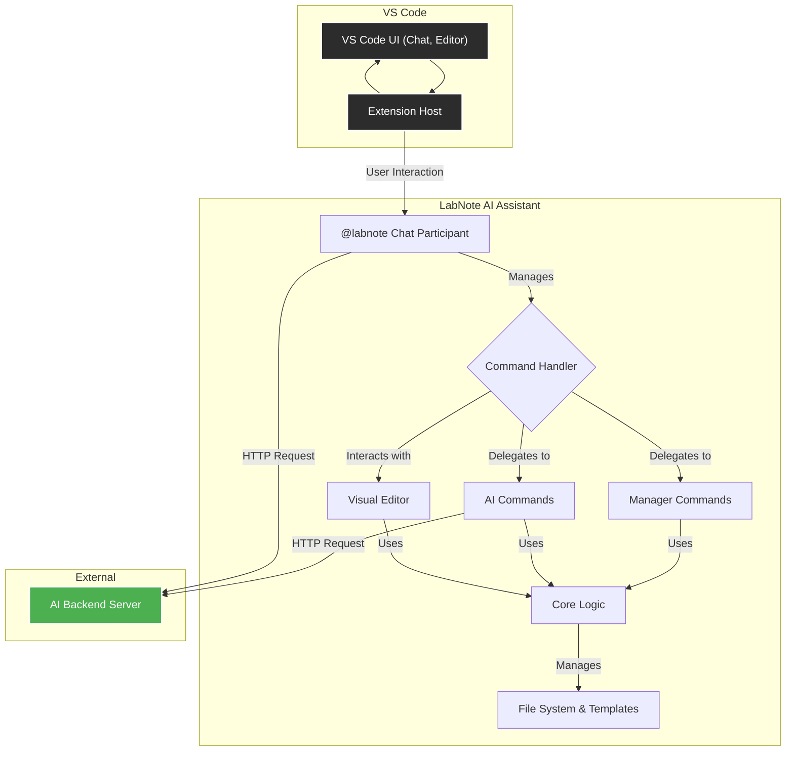
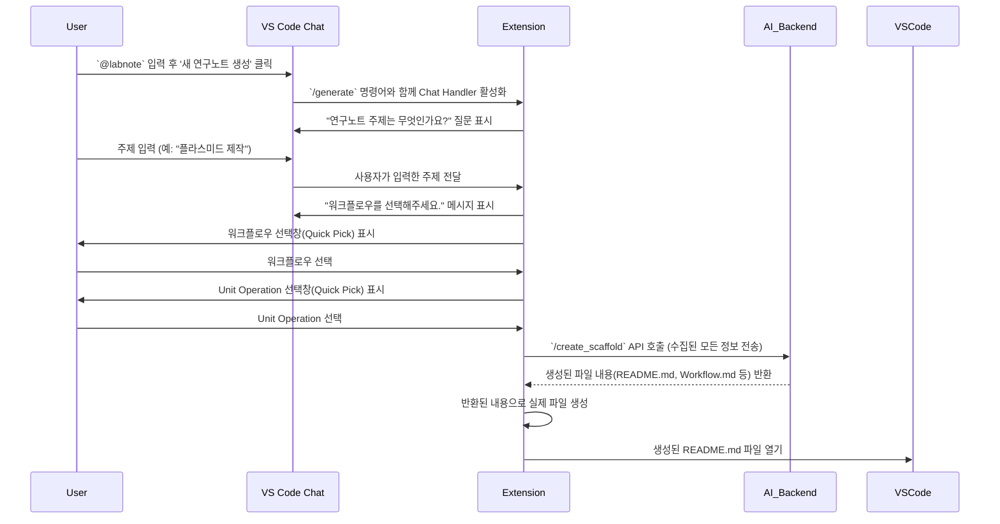
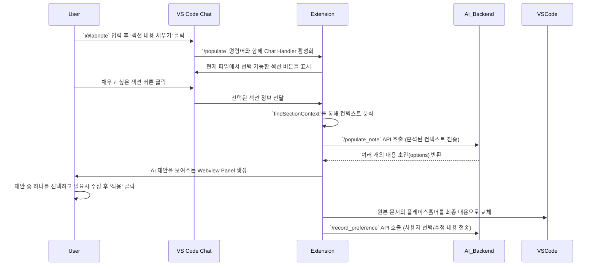

-----

# 🔬 LabNote AI Assistant

**LabNote AI Assistant**는 Visual Studio Code에서 연구노트 작성을 돕는 AI 기반 확장 프로그램입니다. 복잡한 실험 과정의 문서화를 간소화하고, 표준화된 템플릿을 통해 체계적인 기록 관리를 지원하며, AI 기능을 활용하여 연구노트의 초안 생성 및 내용 채우기를 자동화합니다.

-----

## 목차

1.  [주요 기능](#-주요-기능)
2.  [아키텍처](#-아키텍처)
3.  [핵심 워크플로](#-핵심-워크플로)
    * [AI 기반 새 연구노트 생성](#ai-기반-새-연구노트-생성-워크플로)
    * [AI 섹션 내용 채우기](#ai-섹션-내용-채우기-워크플로)
4.  [설치](#-설치)
5.  [사용법 (명령어)](#-사용법-명령어)
6.  [설정](#-설정)
7.  [데이터 활용 및 저작권 정책](#-데이터-활용-및-저작권-정책)
8.  [기여](#-기여)

-----

## ✨ 주요 기능

  * **대화형 AI 어시스턴트 (`@labnote`)**: VS Code 채팅창에서 `@labnote`를 호출하여 AI와 대화하며 연구노트 생성, 섹션 채우기 등 대부분의 기능을 직관적으로 실행할 수 있습니다.
  * **AI 기반 연구노트 자동 생성**: 실험의 핵심 내용을 AI와의 대화를 통해 전달하면, AI가 최적의 워크플로우와 Unit Operation을 조합하여 연구노트의 전체 구조와 파일(Scaffold)을 자동으로 생성합니다.
  * **AI 섹션 내용 채우기**: 연구노트의 각 섹션(Method, Reagent, Results 등)을 AI를 통해 자동으로 채울 수 있습니다. 여러 초안 중 원하는 것을 선택하고 수정하여 AI를 학습시킬 수 있습니다.
  * **Visual Editor**: 마크다운 문법에 익숙하지 않은 사용자를 위해 직관적인 WYSIWYG 편집 환경을 제공합니다. (Quarto CLI 설치 필요)
  * **워크플로우 상태 관리**: 명령어 또는 채팅 UI를 통해 워크플로우와 개별 유닛 오퍼레이션의 완료 상태를 쉽게 업데이트하고, 실험 종료일을 자동으로 기록합니다.
  * **체계적인 템플릿 관리**: `Workflows`, `Hardware/Software Unit Operations` 등 표준화된 템플릿을 쉽게 추가하고 관리할 수 있습니다.
  * **번호 자동 재정렬**: 실험 폴더나 워크플로우 파일의 번호를 자동으로 정렬하여 일관성을 유지합니다.

-----

## 🏗️ 아키텍처

LabNote AI Assistant는 VS Code 확장 프로그램 API를 기반으로, AI 백엔드 서버와 통신하여 핵심 기능을 수행합니다. 주요 구성 요소는 다음과 같습니다.



  * **Extension Host (`extension.ts`)**: 확장 프로그램의 진입점으로, 모든 명령어, 이벤트 리스너, UI(Visual Editor, Chat Participant)를 등록하고 관리합니다.
  * **@labnote Chat Participant**: VS Code 채팅 UI에서 사용자와의 상호작용을 담당합니다. 사용자의 입력을 해석하여 적절한 명령을 실행하고, 다단계 대화를 통해 정보를 수집합니다.
  * **Command Handler**: `@labnote`를 통해 전달된 명령이나 Command Palette 명령을 처리하고 적절한 모듈로 작업을 위임합니다.
  * **AI Commands**: `새 연구노트 생성`, `섹션 내용 채우기` 등 AI 백엔드 서버와 통신이 필요한 기능을 담당합니다.
  * **Manager Commands**: `새 워크플로우 추가`, `번호 재정렬` 등 로컬 파일 시스템과 템플릿을 관리하는 기능을 담당합니다.
  * **Core Logic (`logic.ts`)**: 워크플로우 및 Unit Operation 파싱, 파일 생성, YAML Front Matter 처리 등 확장 프로그램의 핵심 비즈니스 로직을 포함합니다.
  * **Visual Editor (`LabnoteEditorProvider`)**: `.md` 파일을 위한 WYSIWYG 편집기를 제공하며, AI 기능 버튼을 포함합니다.
  * **AI Backend Server**: 자연어 처리, 연구노트 구조 생성, 섹션 내용 제안 등 복잡한 AI 연산을 수행하고 결과를 VS Code로 반환합니다.

-----

## ⚡ 핵심 워크플로

### AI 대화형 새 연구노트 생성 워크플로

사용자가 `@labnote`와 대화하여 새 연구노트를 생성할 때의 내부 처리 흐름입니다.



### AI 섹션 내용 채우기 워크플로

`@labnote`를 통해 섹션 내용을 채울 때의 처리 흐름입니다.



-----

## 📥 설치

1. 제공된 `labnote-ai-aisstant-x.x.x.vsix` 파일을 다운로드합니다.
2. VS Code의 **확장 프로그램(Extensions)** 뷰(`Ctrl+Shift+X`)를 엽니다.
3. 뷰의 오른쪽 상단에 있는 `...` 메뉴를 클릭합니다.
4. *"Install from VSIX..."**를 선택합니다.
5. 다운로드한 `.vsix` 파일을 선택하여 설치합니다.
6. 설치가 완료되면 VS Code를 다시 시작합니다.

-----

## 🚀 사용법

## ☁️ RunPod Serverless 연결 빠른 가이드

1. **RunPod 자격 증명 준비**
   - Serverless Endpoint ID (예: `t8z31me8m865sl`)와 RunPod API Key를 RunPod 콘솔에서 발급합니다.
2. **VS Code 설정 업데이트**
   - `Ctrl+,` → `LabNote` 검색 후 `labnote.ai.backendUrl`을 `runpod://<ENDPOINT_ID>` 또는 `https://<ENDPOINT_ID>.runpod.run` 형태로 입력합니다.
   - `labnote.ai.vesslApiToken`에는 RunPod API Key를 저장합니다. 저장 후 확장은 RunPod `/run` + `/status` API를 통해 백엔드 엔드포인트를 호출합니다.
3. **GitHub 토큰 공유**
   - 컨테이너에서 백엔드 리포지토리를 클론할 수 있도록 RunPod Serverless Endpoint에 `github_token` 시크릿을 등록합니다. (이미지 빌드 시 동일한 이름으로 사용합니다.)
4. **동작 확인**
   - VS Code의 `LabNote AI` Output 채널에서 RunPod 호출 로그를 확인할 수 있습니다. 성공 시 RunPod Job ID가 표시되고, 응답이 도착하면 섹션 초안/채팅 결과가 출력됩니다.

> RunPod API 호출 예시는 백엔드 리포지토리의 [0. RunPod Serverless 배포 빠른 시작](../labnote-ai-backend/README.md#0-runpod-serverless-배포-빠른-시작)을 참고하세요.

### 🤖 AI 어시스턴트와 대화하기 (`@labnote`)

VS Code의 채팅 뷰에서 `@labnote`를 입력하여 AI 어시스턴트를 호출하는 것이 가장 권장되는 사용법입니다.

1.  **시작**: 채팅창에 `@labnote`를 입력하면 시작 메뉴가 나타납니다.
2.  **기능 선택**: 버튼을 클릭하여 원하는 기능을 대화형으로 실행합니다.
      * **🔬 새 연구노트 생성**: AI의 질문에 따라 '주제 -\> 워크플로우 -\> Unit Operation' 순서로 답변하며 연구노트를 생성합니다.
      * **✍️ Fill Section Content (AI)**: Choose a section in the current file and let the AI draft the content for you.
      * **➕ Add Workflow**: Insert a standard workflow into the active lab note.
      * **➕ Add Unit Operation**: Append a hardware or software unit operation to the current workflow file.
      * **🔄 Renumber Workflows**: Resequence workflow file numbers inside the current experiment folder.
      * **🗂️ Renumber Experiment Folders**: Resequence every experiment folder number under the `labnote` directory.
      * **✅ Complete Current Unit Operation**: Mark a unit operation from the current file as complete.
      * **🏁 Complete Current Workflow**: Mark the current workflow complete and record its completion date (all unit operations must already be complete).
3.  **General questions**: Ask free-form scientific questions with `@labnote [your prompt]`.
4.  **Cancel task**: Enter `/cancel` at any time to stop the current chat task.

### ⌨️ Command Palette

Press `Ctrl+Shift+P` to open the Command Palette and type `LabNote:` to run any command directly.

| Command | Description |
| --- | --- |
| `LabNote: new` | Use AI to generate a new experiment folder and lab note scaffold (form-driven flow rather than chat). |
| `LabNote (AI): populate Section`| Ask the AI to fill the section that the cursor currently highlights in the text editor. |
| `LabNote: new workflow` | Insert the standard workflow template into the active lab note (`README.md`). |
| `LabNote: new HW Unit Operation` / `LabNote: new SW Unit Operation`| Add a hardware or software unit operation to the current workflow file. |
| `LabNote: Add templates manager` | Open the workflow and unit operation template files for direct editing. |
| `LabNote: Add insert Table` | Quickly insert a Markdown table. |
| `LabNote: reorder workflows` | Resequence workflow file numbers (`001_`, `002_`, …) inside the current experiment folder. |
| `LabNote: complete workflow` | Mark the current workflow complete and record its completion date (all unit operations must already be complete). |
| `LabNote: complete unit operation` | Mark the unit operation at the cursor location complete and record its completion date. |
| `LabNote: reorder labnotes` | Resequence every experiment folder number within the `labnote` directory. |

## 9. VS Code Continue 연동 가이드

이 백엔드 서버를 VS Code의 **Continue** 확장 프로그램과 연동하면, IDE 내에서 직접 코드 자동 완성, 채팅, 그리고 LabNote 전용 Slash 명령(DPO 피드백, RAG 검색, Supervisor 기반 Agents)을 활용할 수 있습니다.

### 사전 준비
1.  Visual Studio Code를 엽니다.
2.  `Ctrl+Shift+X`를 눌러 확장 프로그램 마켓플레이스를 엽니다.
3.  `Continue`를 검색하여 **Continue.dev**에서 게시한 공식 확장을 설치합니다.

### 1단계: Continue 설정 파일 (`config.yaml`) 수정

1.  사용자 PC의 Continue 설정 파일을 엽니다.
    * **Windows**: `C:\Users\<사용자 이름>\.continue\config.yaml`
    * **macOS / Linux**: `~/.continue/config.yaml`

2.  아래 예시를 참고하여 `models` 섹션을 업데이트합니다. `apiBase`에는 RunPod Serverless에서 생성된 **단일 엔드포인트 URL**을 입력합니다.
```
name: "labnote-default"
version: "1.0.0"
schema: "v1"

models:
  - name: "LabNote Backend" 
    provider: openai
    model: "labnote-backend"
    # RunPod Serverless Endpoint (동기 실행)
    apiBase: "https://api.runpod.ai/v2/[YOUR_SERVERLESS_ENDPOINT_ID]/runsync"
    apiKey: "YOUR_RUNPOD_API_KEY"
    title: "LabNote Backend"


contextProviders:
  - name: "active_file_content"
    class: "FileContextProvider"
    params:
      filepath: "{{active_file_filepath}}"

slashCommands:
  - name: "populate"
    description: "Populate a section in the current lab note (e.g., /populate UHW010 Method)"
    prompt: |
      /populate {{user_input}}
      ```markdown
      {{active_file_content}}
      ```

    model: "LabNote Backend"
```    
### 3단계: Continue에서 활용 가능한 LabNote 전용 기능

- **Populate & DPO 피드백 연동**: `/populate <UO_ID> <Section>` 명령으로 초안을 생성하고, 원하는 번호를 답하면 DPO 데이터가 백엔드로 기록됩니다. 응답에는 섹션에 바로 적용 가능한 `diff` 코드블록이 함께 제공되며, 동일한 옵션을 반복 선택하면 중복 학습을 방지하기 위해 경고만 출력됩니다.
- **RAG + Supervisor Agents**: `LabNote Backend Logic` 모델은 랩노트 전체 문서를 분석하여 RAG 검색과 Supervisor 기반 에이전트 팀을 조합해 고품질 섹션 초안을 제공합니다.
- **일반 대화/코딩 보조**: `/populate` 명령 없이 대화하면 Ollama에 등록된 LLM(8B, 70B, Mixtral 등)이 일반적인 Q&A나 코드 생성을 담당합니다. 

1.  내용을 채우고 싶은 연구노트 마크다운 파일을 엽니다.

2.  Continue 채팅창에서 `/populate`를 입력하고, **"UO_ID Section"** 형식으로 요청합니다.

    *   **예시**: `/populate UHW010 Method`

3.  AI가 파일 컨텍스트를 기반으로 해당 섹션의 내용을 생성하여 제안합니다.

    

## ⚙️ 설정

`Ctrl+,`를 눌러 설정을 열고 `LabNote`를 검색하여 확장 프로그램 관련 설정을 변경할 수 있습니다.

| 설정 | 설명 | 기본값 |
| --- | --- | --- |
| `labnote.ai.backendUrl` | RunPod Serverless 엔드포인트를 지정합니다. (`runpod://<ID>` 또는 `https://<ID>.runpod.run`) | `runpod://t8z31me8m865sl` |
| `labnote.ai.vesslApiToken`| RunPod API Key를 저장합니다. | `rp_sk_********` |
| `labnote.manager.workflowsPath` | 사용자 정의 워크플로우 마크다운 파일의 경로입니다. | `""` |
| `labnote.manager.hwUnitOperationsPath`| 사용자 정의 하드웨어 Unit Operation 마크다운 파일의 경로입니다. | `""` |
| `labnote.manager.swUnitOperationsPath`| 사용자 정의 소프트웨어 Unit Operation 마크다운 파일의 경로입니다. | `""` |

-----

## ⚖️ 데이터 활용 및 저작권 정책

### 데이터 활용 동의

`AI 섹션 내용 채우기` 기능을 최초로 사용할 때, AI 모델 성능 향상을 위한 데이터 활용 동의를 요청합니다.

  * **동의 시**: 사용자가 AI가 제안한 여러 초안 중 **최종 선택한 내용**과, 이를 **수정한 내용**이 익명화되어 서버로 전송됩니다. 이 데이터는 AI 모델을 학습(Direct Preference Optimization)시키는 데에만 사용됩니다.
  * **거부 시**: `AI 섹션 내용 채우기` 기능이 비활성화됩니다. 다른 AI 기능(새 연구노트 생성, 일반 대화)은 정상적으로 사용할 수 있습니다.

### 저작권

  * **사용자 생성 콘텐츠**: 사용자가 이 확장 프로그램을 통해 작성하고 수정한 모든 연구노트의 저작권은 **사용자**에게 있습니다.
  * **AI 생성 콘텐츠**: AI가 생성한 초안은 사용자의 작업을 돕기 위한 보조 자료이며, 최종 콘텐츠에 대한 책임과 권리는 이를 채택하고 수정한 사용자에게 귀속됩니다.
